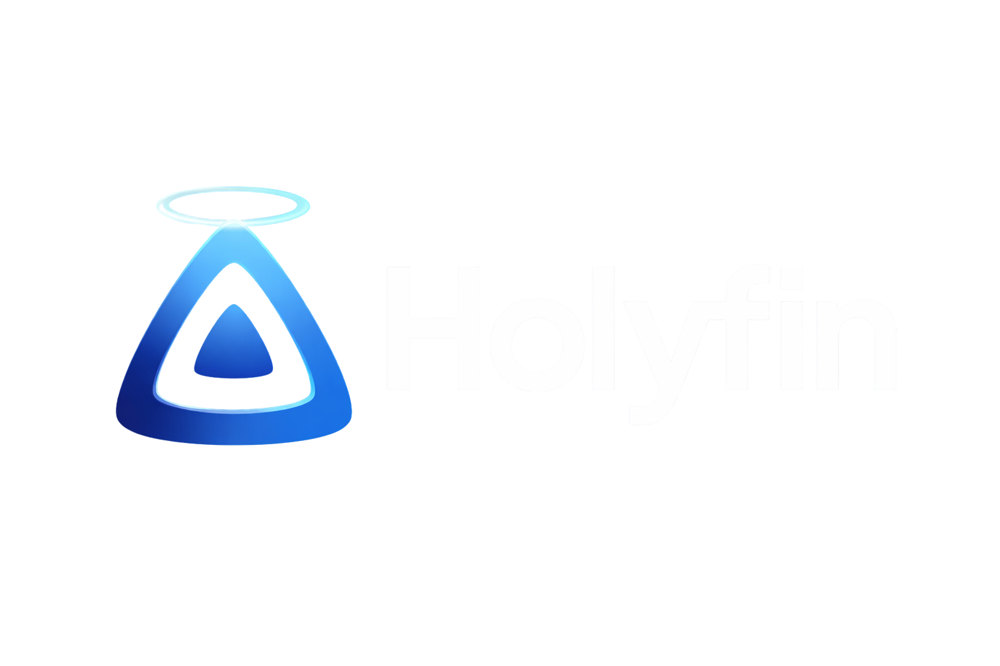

# 🎨 HolyFin - Premium Indigo Jellyfin Theme

<div align="center">



[](https://www.jsdelivr.com/package/gh/HeiligerG/HolyFin)
[](https://github.com/HeiligerG/HolyFin/stargazers)
[](LICENSE)

**A sophisticated Jellyfin theme with deep indigo aesthetics**

*Based on the excellent [ElegantFin](https://github.com/lscambo13/ElegantFin) by lscambo13*

[Quick Start](#-quick-installation) • [Features](#-features) • [Customization](#-customization) • [Credits](#-credits)

</div>

---

## ✨ Features

- 🎨 **Deep Indigo Color Palette** - Sophisticated purple-blue tones throughout
- 🎯 **HolyFin Branding** - Custom "HolyFin" text logo with gradient
- 📱 **Universal Compatibility** - Works on desktop, mobile, and TV
- 🎬 **Modern Layouts** - Clean, contemporary design language
- ⚡ **Smooth Animations** - Polished transitions and hover effects
- 💎 **Glassmorphism Effects** - Beautiful frosted glass aesthetics
- 🌈 **Indigo Progress Bars** - Vibrant gradient progress indicators
- 🔧 **Highly Customizable** - Easy CSS variable overrides
- 🌐 **CDN Delivery** - Fast loading via jsDelivr

---

## 🚀 Quick Installation

### Method 1: CDN Import (Recommended)

1. Open Jellyfin **Dashboard** → **General** (or **Branding** on 10.11.X)
2. Scroll to **Custom CSS** section
3. Paste this code:

```css
@import url("https://cdn.jsdelivr.net/gh/HeiligerG/HolyFin@main/Theme/HolyFin-jellyfin-theme-build-latest-minified.css");
```

4. Click **Save** and refresh your browser (CTRL + F5)

### Method 2: Client-Side

1. Open **Settings** → **Display**
2. Find **Custom CSS** box
3. Paste the same import code
4. Save and refresh

---

## 🎨 Color Palette

HolyFin uses a carefully curated indigo color scheme:

| Color | Hex | Usage |
|-------|-----|-------|
| Primary Indigo | `#5E35B1` | Buttons, accents, primary brand |
| Deep Purple | `#673AB7` | Hover states, highlights |
| Indigo 600 | `#3949AB` | Active states, selections |
| Purple Tint | `#7E57C2` | Secondary accents, borders |

---

## 🧩 Customization

### Custom "HolyFin" Logo Colors

Override the logo gradient:

```css
.pageTitle img[src*="logo"]::after,
.headerLogo img::after {
    background: linear-gradient(135deg, #YOUR-COLOR-1, #YOUR-COLOR-2) !important;
    -webkit-background-clip: text !important;
    -webkit-text-fill-color: transparent !important;
}
```

### Enable Extra Card Buttons

Show Mark Played / Favorites buttons on hover:

```css
:root {
    --extraCardButtonsVisibility: block;
}
```

### Center Play Button on Cards

```css
:root {
    --overlayPlayButtonPosition: 50%;
}
```

### Disable Card Hover Effect

```css
:root {
    --cardHoverEffect: none;
}
```

### Custom Accent Color

Change the primary indigo color:

```css
:root {
    --holyfin-purple-600: #YOUR-HEX-COLOR;
    --activeColor: #YOUR-HEX-COLOR;
    --uiAccentColor: #YOUR-HEX-COLOR;
}
```

---

## 📸 Screenshots

<details>
<summary>Click to view screenshots</summary>

> **Note:** Screenshots coming soon! HolyFin is freshly customized from ElegantFin.
>
> In the meantime, refer to [ElegantFin screenshots](https://github.com/lscambo13/ElegantFin#screenshots) - HolyFin looks similar but with deep indigo colors and "HolyFin" branding.

</details>

---

## ✅ Tested On

- ✅ Jellyfin Server v10.11.X
- ✅ Modern browsers (Chrome, Firefox, Edge, Safari)
- ✅ Jellyfin Android App v2.6.X+
- ✅ Jellyfin Web (all platforms)
- ⚠️ TV compatibility inherited from ElegantFin

---

## 🛠️ Troubleshooting

**Q: How do I check my HolyFin version?**
A: Look at the footer in Settings - it should show `HolyFin v1.0.0`

**Q: I don't see the update?**
A: Clear your browser cache (CTRL + F5) or sign out/in on apps

**Q: The logo still shows "Jellyfin"?**
A: Make sure you hard-refreshed (CTRL + F5). The CSS replaces it client-side.

**Q: Icons broken on LG TV?**
A: Add this to your Custom CSS:
```css
:root {
    --iconPack: 'Material Icons';
}
```

**Q: Can I use both HolyFin AND ElegantFin styles?**
A: No - they are separate themes. HolyFin is a customized fork with indigo colors.

---

## 📝 Credits

### Original Theme
**ElegantFin** by [lscambo13](https://github.com/lscambo13)
HolyFin is based on the excellent work of the ElegantFin project. All core functionality and design patterns come from ElegantFin.

### HolyFin Customization
- **Indigo color scheme** by **HolyG** ([@HeiligerG](https://github.com/HeiligerG))
- **Text logo implementation** by HolyG
- **Modern enhancements** (glassmorphism, animations) by HolyG

### License
[GPL-2.0 License](LICENSE) - Same as original ElegantFin

---

## 🤝 Contributing

Contributions welcome! Please read [CONTRIBUTING.md](CONTRIBUTING.md) before submitting PRs.

**Quick contribution guidelines:**
- Keep the indigo color scheme consistent
- Test on desktop, mobile, and TV (if possible)
- Follow the existing code style
- Document any new customization options

---

## 💬 Feedback & Support

- 🐛 [Report a Bug](https://github.com/HeiligerG/HolyFin/issues/new?template=bug_report.md)
- 💡 [Request a Feature](https://github.com/HeiligerG/HolyFin/issues/new?template=feature_request.md)
- 💬 [Discussions](https://github.com/HeiligerG/HolyFin/discussions)
- ⭐ [Star this repo](https://github.com/HeiligerG/HolyFin/stargazers) if you like it!

---

## 📊 What's Different from ElegantFin?

HolyFin is a customized fork with these key changes:

| Feature | ElegantFin | HolyFin |
|---------|------------|---------|
| Primary Color | Blue/Purple | Deep Indigo (#5E35B1) |
| Logo | Jellyfin logo | "HolyFin" text gradient |
| Accents | Various | Consistent indigo palette |
| Progress Bars | Standard | Indigo gradient with glow |
| Scrollbars | Default | Custom indigo themed |
| Cards | Standard | Glassmorphism + indigo borders |
| Branding | ElegantFin | HolyFin |

**If you prefer the original:** Use [ElegantFin](https://github.com/lscambo13/ElegantFin) instead!

---

## 🔮 Future Plans

- [ ] Create custom screenshots showcasing indigo theme
- [ ] Add more color variants (e.g., "HolyFin Deep Purple", "HolyFin Teal")
- [ ] Improve TV compatibility testing
- [ ] Community-contributed customization presets
- [ ] Optional HolyFin logo image (SVG)

---

<div align="center">

**Made with 💜 by HolyG**

*Powered by [Jellyfin](https://jellyfin.org) • Inspired by [ElegantFin](https://github.com/lscambo13/ElegantFin)*

**[⬆ Back to Top](#-holyfin---premium-indigo-jellyfin-theme)**

</div>
